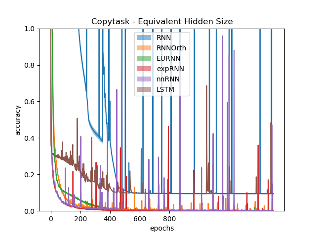
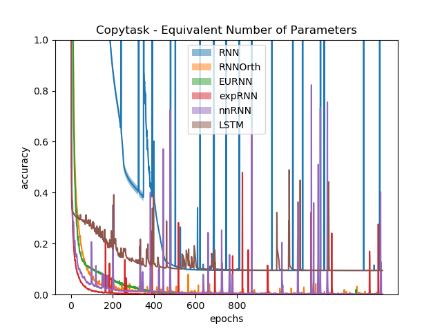
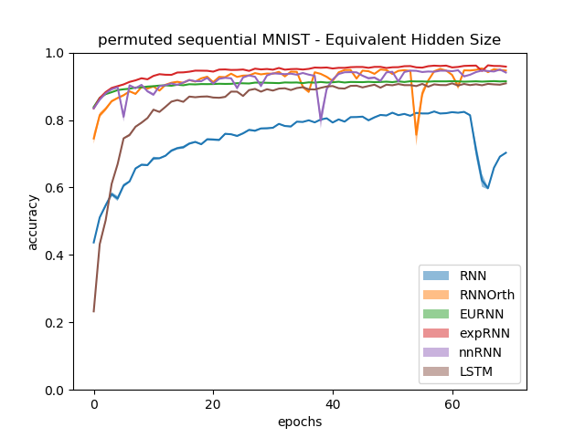
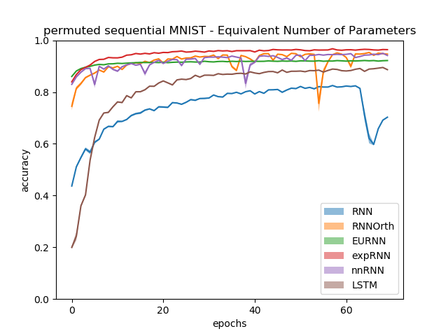

# Non-normal Recurrent Neural Network (nnRNN): learning long time dependencies while improving expressivity with transient dynamics

[nnRNN](https://arxiv.org/abs/1905.12080) - NeurIPS 2019

expRNN code taken from  [here](https://github.com/Lezcano/expRNN)

EURNN tests based on code taken from  [here](https://github.com/jingli9111/EUNN-tensorflow)

## Summary of Current Results
### Copytask




### Permuted Sequential MNIST




### PTB
Changes from paper:
- Testing of Adam optimizer using betas (0.0, 0.9)
- Added grad clipping
#### Test Bit per Character (BPC)
<table>
  <tr>
    <td></td>
    <td colspan="2" style="text-align:center;">Fixed # of params (~1.32 M)</td>
    <td colspan="2" style="text-align:center;">Fixed # hidden units (N=1024)</td>
  </tr>
  <tr>
    <td>Model</td>
    <td>T<sub>PTB</sub> = 150   </td>
    <td>T<sub>PTB</sub> = 300   </td>
    <td>T<sub>PTB</sub> = 150   </td>
    <td>T<sub>PTB</sub> = 300   </td>
  </tr>
  <tr>
    <td>RNN</td>
    <td> 2.89 ± 0.002  </td>
    <td> 2.90 ± 0.002  </td>
    <td> 2.89 ± 0.002  </td>
    <td>  2.90 ± 0.002 </td>
  </tr>
  <tr>
    <td>RNN-orth</td>
    <td> 1.62 ± 0.004  </td>
    <td> 1.66 ± 0.006  </td>
    <td> 1.62 ± 0.004   </td>
    <td>   1.66 ± 0.006 </td>
  </tr>
  <tr>
    <td>EURNN</td>
    <td> 1.61 ± 0.001	  </td>
    <td> 1.62 ± 0.001	  </td>
    <td> 1.69 ± 0.001	   </td>
    <td>   1.68 ± 0.001    </td>
  </tr>
  <tr>
    <td>expRNN</td>
    <td> 1.43 ± 0.002  </td>
    <td> 1.44 ± 0.002  </td>
    <td> 1.45 ± 0.002  </td>
    <td>  1.48 ± 0.008 </td>
  </tr>
  <tr>
    <td>nnRNN</td>
    <td> 1.40 ± 0.003  </td>
    <td> 1.42 ± 0.003   </td>
    <td>  1.40 ± 0.003  </td>
    <td> 1.42 ± 0.003   </td>
  </tr>

</table>

#### Accuracy
<table>
  <tr>
    <td></td>
    <td colspan="2" style="text-align:center;">Fixed # of params (~1.32 M)</td>
    <td colspan="2" style="text-align:center;">Fixed # hidden units (N=1024)</td>
  </tr>
  <tr>
    <td>Model</td>
    <td>T<sub>PTB</sub> = 150   </td>
    <td>T<sub>PTB</sub> = 300   </td>
    <td>T<sub>PTB</sub> = 150   </td>
    <td>T<sub>PTB</sub> = 300   </td>
  </tr>
  <tr>
    <td>RNN</td>
    <td> 40.01 ± 0.026  </td>
    <td> 39.97 ± 0.025  </td>
    <td> 40.01 ± 0.026  </td>
    <td> 39.97 ± 0.025  </td>
  </tr>
  <tr>
    <td>RNN-orth</td>
    <td> 66.29 ± 0.07  </td>
    <td> 65.53 ± 0.09  </td>
    <td> 66.29 ± 0.07  </td>
    <td> 65.53 ± 0.09  </td>
  </tr>
  <tr>
    <td>EURNN</td>
    <td> 65.68 ± 0.002	  </td>
    <td> 65.55 ± 0.002	  </td>
    <td> 64.01 ± 0.002	   </td>
    <td>   64.20 ± 0.003    </td>
  </tr>
  <tr>
    <td>expRNN</td>
    <td>  69.02 ± 0.0005 </td>
    <td>  68.98 ± 0.0003 </td>
    <td>   </td>
    <td>   </td>
  </tr>
  <tr>
    <td>nnRNN</td>
    <td>  69.89 ± 0.001</td>
    <td> 69.54 ± 0.001  </td>
    <td>  69.89 ± 0.001 </td>
    <td> 69.54 ± 0.001  </td>
  </tr>

</table>

#### Hyperparameters for reported results

##### Copytask
  <table>
    <tr>
        <td>Model</td>
        <td>Hidden Size</td>
        <td>Optimizer</td>
        <td>LR</td>
        <td>Orth. LR</td>
        <td>$$\delta$$</td>
        <td>T decay</td>
        <td>Recurrent init</td>
    </tr>
    <tr>
        <td>RNN</td>
        <td>128</td>
        <td>RMSprop $$\alpha=0.9$$</td>
        <td>0.001</td>
        <td></td>
        <td></td>
        <td></td>
        <td>Glorot Normal</td>
    </tr>
    <tr>
        <td>RNN-orth</td>
        <td> 128</td>
        <td>RMSprop $$\alpha=0.99$$ </td>
        <td>0.0002 </td>
        <td> </td>
        <td></td>
        <td></td>
        <td>Random Orth</td>
    </tr>
    <tr>
        <td>EURNN</td>
        <td> 128</td>
        <td>RMSprop $$\alpha=0.5$$ </td>
        <td>0.001 </td>
        <td> </td>
        <td></td>
        <td></td>
        <td></td>
    </tr>
    <tr>
        <td>EURNN</td>
        <td> 256</td>
        <td>RMSprop $$\alpha=0.5$$ </td>
        <td>0.001 </td>
        <td> </td>
        <td></td>
        <td></td>
        <td></td>
    </tr>
    <tr>
        <td>expRNN</td>
        <td> 128</td>
        <td>RMSprop $$\alpha=0.99$$ </td>
        <td>0.001 </td>
        <td> 0.0001</td>
        <td></td>
        <td></td>
        <td>Henaff</td>
    </tr>
    <tr>
        <td>expRNN</td>
        <td> 176</td>
        <td>RMSprop $$\alpha=0.99$$ </td>
        <td>0.001 </td>
        <td> 0.0001</td>
        <td></td>
        <td></td>
        <td>Henaff</td>
    </tr>
    <tr>
        <td>nnRNN</td>
        <td>128 </td>
        <td>  RMSprop $$\alpha=0.99$$ </td>
        <td>0.0005 </td>
        <td>10<sup>-6</sup> </td>
        <td>0.0001</td>
        <td>10<sup>-6</sup></td>
        <td>Cayley</td>
    </tr>

  </table>


##### sMNIST
  <table>
    <tr>
        <td>Model</td>
        <td>Hidden Size</td>
        <td>Optimizer</td>
        <td>LR</td>
        <td>Orth. LR</td>
        <td>$$\delta$$</td>
        <td>T decay</td>
        <td>Recurrent init</td>
    </tr>
    <tr>
        <td>RNN</td>
        <td>512</td>
        <td>RMSprop $$\alpha=0.9$$</td>
        <td>0.0001</td>
        <td></td>
        <td></td>
        <td></td>
        <td>Glorot Normal</td>
    </tr>
    <tr>
        <td>RNN-orth</td>
        <td> 512</td>
        <td>RMSprop $$\alpha=0.99$$ </td>
        <td>5*10<sup>-5</sup> </td>
        <td> </td>
        <td></td>
        <td></td>
        <td>Random orth</td>
    </tr>
    <tr>
        <td>EURNN</td>
        <td> 512</td>
        <td>RMSprop $$\alpha=0.9$$ </td>
        <td>0.0001 </td>
        <td> </td>
        <td></td>
        <td></td>
        <td></td>
    </tr>
    <tr>
        <td>EURNN</td>
        <td> 1024</td>
        <td>RMSprop $$\alpha=0.9$$ </td>
        <td>0.0001 </td>
        <td> </td>
        <td></td>
        <td></td>
        <td></td>
    </tr>
    <tr>
        <td>expRNN</td>
        <td> 512</td>
        <td>RMSprop $$\alpha=0.99$$ </td>
        <td>0.0005 </td>
        <td>5*10<sup>-5</sup> </td>
        <td></td>
        <td></td>
        <td>Cayley</td>
    </tr>
    <tr>
        <td>expRNN</td>
        <td>722</td>
        <td>RMSprop $$\alpha=0.99$$ </td>
        <td>5*10<sup>-5</sup> </td>
        <td> </td>
        <td></td>
        <td></td>
        <td>Cayley</td>
    </tr>
    <tr>
        <td>nnRNN</td>
        <td>512 </td>
        <td> RMSprop $$\alpha=0.99$$  </td>
        <td>0.0002 </td>
        <td>2*10<sup>-5</sup> </td>
        <td>0.1</td>
        <td>0.0001</td>
        <td>Cayley</td>
    </tr>
    <tr>
        <td>LSTM</td>
        <td>  512 </td>
        <td>  RMSprop $$\alpha=0.99$ </td>
        <td>0.0005 </td>
        <td> </td>
        <td></td>
        <td></td>
        <td>Glorot Normal</td>
    </tr>
        <tr>
        <td>LSTM</td>
        <td>  257 </td>
        <td>  RMSprop $$\alpha=0.9$$ </td>
        <td>0.0005 </td>
        <td> </td>
        <td></td>
        <td></td>
        <td>Glorot Normal</td>
    </tr>
  </table>
 
##### PTB
<table>
  <tr>
    <td>Model</td>
    <td>Hidden Size</td>
    <td>Optimizer</td>
    <td>LR</td>
    <td>Orth. LR</td>
    <td>$$\delta$$</td>
    <td>T decay</td>
    <td>Recurrent init</td>
    <td>Grad Clipping Value</td>
  </tr>
  <tr>
    <td colspan="9" style="text-align:center;">Length=150</td>
  </tr>
  <tr>
    <td>RNN</td>
    <td>1024</td>
    <td>RMSprop $$\alpha=0.9$$</td>
    <td>10<sup>-5</sup></td>
    <td></td>
    <td></td>
    <td></td>
    <td>Glorot Normal</td>
    <td></td>
  </tr>
  <tr>
    <td>RNN-orth</td>
    <td> 1024</td>
    <td>RMSprop $$\alpha=0.9$$ </td>
    <td>0.0001 </td>
    <td> </td>
    <td></td>
    <td></td>
    <td>Cayley</td>
    <td></td>
  </tr>
  <tr>
    <td>EURNN</td>
    <td> 1024</td>
    <td>RMSprop $$\alpha=0.9$$ </td>
    <td>0.001 </td>
    <td> </td>
    <td></td>
    <td></td>
    <td></td>
    <td></td>
  </tr>
  <tr>
    <td>EURNN</td>
    <td> 2048</td>
    <td>RMSprop $$\alpha=0.9$$ </td>
    <td>0.001 </td>
    <td> </td>
    <td></td>
    <td></td>
    <td></td>
    <td></td> 
  </tr>
  <tr>
    <td>expRNN</td>
    <td> 1024</td>
    <td>RMSprop $$\alpha=0.9$$ </td>
    <td>0.001 </td>
    <td> </td>
    <td></td>
    <td></td>
    <td>Cayley</td>
    <td></td>
  </tr>
   <tr>
    <td>expRNN</td>
    <td> 1386</td>
    <td>RMSprop $$\alpha=0.9$$ </td>
    <td>0.008 </td>
    <td>0.0008 </td>
    <td></td>
    <td></td>
    <td>Cayley</td>
    <td></td>
  </tr>
  <tr>
    <td>nnRNN</td>
    <td>  1024 </td>
    <td>  Adam $$\Beta = (0.0,0.9) $$ </td>
    <td>0.002 </td>
    <td> 0.0002 </td>
    <td>0.0001</td>
    <td>10<sup>-5</sup></td>
    <td>Cayley</td>
    <td>10</td>
  </tr>
  <tr>
    <td colspan="9" style="text-align:center;">Length=300</td>
  </tr>
  <tr>
    <td>RNN</td>
    <td>1024</td>
    <td>RMSprop $$\alpha=0.9$$</td>
    <td>10<sup>-5</sup></td>
    <td></td>
    <td></td>
    <td></td>
    <td>Glorot Normal</td>
    <td></td>
  </tr>
  <tr>
    <td>RNN-orth</td>
    <td> 1024</td>
    <td>RMSprop $$\alpha=0.9$$ </td>
    <td>0.0001 </td>
    <td> </td>
    <td></td>
    <td></td>
    <td>Cayley</td>
    <td></td>
  </tr>
  <tr>
    <td>EURNN</td>
    <td> 1024</td>
    <td>RMSprop $$\alpha=0.9$$ </td>
    <td>0.001 </td>
    <td> </td>
    <td></td>
    <td></td>
    <td></td>
    <td></td>
  </tr>
  <tr>
    <td>EURNN</td>
    <td> 2048</td>
    <td>RMSprop $$\alpha=0.9$$ </td>
    <td>0.001 </td>
    <td> </td>
    <td></td>
    <td></td>
    <td></td>
    <td></td>
  </tr>
  <tr>
    <td>expRNN</td>
    <td> 1024</td>
    <td>RMSprop $$\alpha=0.9$$ </td>
    <td>0.001 </td>
    <td> </td>
    <td></td>
    <td></td>
    <td>Cayley</td>
    <td></td>
  </tr>
   <tr>
    <td>expRNN</td>
    <td> 1386</td>
    <td>RMSprop $$\alpha=0.9$$ </td>
    <td>0.001 </td>
    <td> </td>
    <td></td>
    <td></td>
    <td>Cayley</td>
    <td></td>
  </tr>
  <tr>
    <td>nnRNN</td>
    <td>  1024 </td>
    <td> Adam $$\Beta = (0.0, 0.9) $$  </td>
    <td>0.002 </td>
    <td> 0.0002</td>
    <td>0.0001</td>
    <td>10<sup>-6</sup></td>
    <td>Cayley</td>
    <td>5</td>    
  </tr>
</table>

## Usage

### Copytask

```
python copytask.py [args]
```
Options:
- net-type : type of RNN to use in test
- nhid : number if hidden units
- cuda : use CUDA
- T : delay between sequence lengths
- labels : number of labels in output and input, maximum 8
- c-length : sequence length
- onehot : onehot labels and inputs
- vari : variable length
- random-seed : random seed for experiment
- batch : batch size
- lr : learning rate for optimizer
- lr_orth : learning rate for orthogonal optimizer
- alpha : alpha value for optimizer (always RMSprop) 
- rinit : recurrent weight matrix initialization options: \[xavier, henaff, cayley, random orth.\]
- iinit : input weight matrix initialization, options: \[xavier, kaiming\]
- nonlin : non linearity type, options: \[None, tanh, relu, modrelu\]
- alam : strength of penalty on (\delta in the paper)
- Tdecay : weight decay on upper triangular matrix values

### permuted sequtential MNIST

```
python sMNIST.py [args]
```

Options:
- net-type : type of RNN to use in test
- nhid : number if hidden units
- epochs : number of epochs
- cuda : use CUDA
- permute : permute the order of the input
- random-seed : random seed for experiment (excluding permute order which has independent seed)
- batch : batch size
- lr : learning rate for optimizer
- lr_orth : learning rate for orthogonal optimizer
- alpha : alpha value for optimizer (always RMSprop) 
- rinit : recurrent weight matrix initialization options: \[xavier, henaff, cayley, random orth.\]
- iinit : input weight matrix initialization, options: \[xavier, kaiming\]
- nonlin : non linearity type, options: \[None, tanh, relu, modrelu\]
- alam : strength of penalty on (\delta in the paper)
- Tdecay : weight decay on upper triangular matrix values
- save_freq : frequency in epochs to save data and network


### PTB 
Adapted from [here](https://github.com/salesforce/awd-lstm-lm)
```
python language_task.py [args]
```

Options:
- net-type : type of RNN to use in test
- emsize : size of word embeddings
- nhid : number if hidden units
- epochs : number of epochs
- bptt : sequence length for back propagation
- cuda : use CUDA
- seed : random seed for experiment (excluding permute order which has independent seed)
- batch : batch size
- log-interval : reporting interval
- save : path to save final model and test info
- lr : learning rate for optimizer
- lr_orth : learning rate for orthogonal optimizer
- rinit : recurrent weight matrix initialization options: \[xavier, henaff, cayley, random orth.\]
- iinit : input weight matrix initialization, options: \[xavier, kaiming\]
- nonlin : non linearity type, options: \[None, tanh, relu, modrelu\]
- alam : strength of penalty on (\delta in the paper)
- Tdecay : weight decay on upper triangular matrix values
- optimizer : choice of optimizer between RMSprop and Adam
- alpha : alpha value for optimizer (always RMSprop) 
- betas : beta values for adam optimizer 